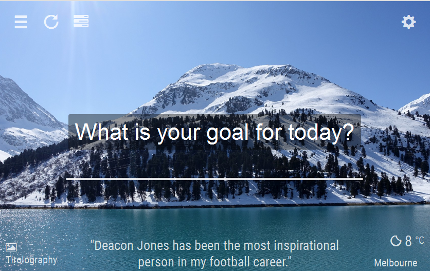

# DEPRECATED

Tomataboard is a personal dashboard. It can help you be more productive and stay focused on the task at hand.

It provides todos and timers. It can help you beat procrastination with its anti-procrastination (pomodoro) timer. It provides inspiration with daily quotes and gorgeous photos.

### Live Site
View Tomataboard in action [here](http://www.tomataboard.com)

## Screenshot

### How to use it?
Best way to use it is to set the live site [tomataboard](http://www.tomataboard.com/focus) as your home page or your new tab page in your favourite browser.

### Build with
* ASP.NET Core 1.0
* Entity Framework 1.0
* AngularJS 1.4
* Azure Websites
* Bootstrap 3
* [Grayscale Jekyll theme](https://github.com/jeromelachaud/grayscale-theme)

### Power by APIs
* [500px](https://500px.com)
* [Flickr](https://www.flickr.com/)
* [Yahoo Weather](https://weather.yahoo.com)
* [Forecast.io](http://forecast.io)
* [OpenWeatherMap](http://openweathermap.org)
* [Freegeoip](http://freegeoip.net)
* [GeoLite2](https://dev.maxmind.com/geoip/geoip2/geolite2/)
* [IP Location Finder](https://www.iplocation.net)

### Acknowledgments
* Thanks to Dimitrios Barbatsoulis for his beautiful winter photos.
* Tomataboard is inspired by Chrome extension [Momentum](https://chrome.google.com/webstore/detail/momentum/laookkfknpbbblfpciffpaejjkokdgca).
* Thanks to [JetBrains](https://www.jetbrains.com) for the OSS license of Resharper Ultimate.
Proudly developed using:

## License
This project is licensed under the MIT License - see the [LICENSE](LICENSE.md) file for details
